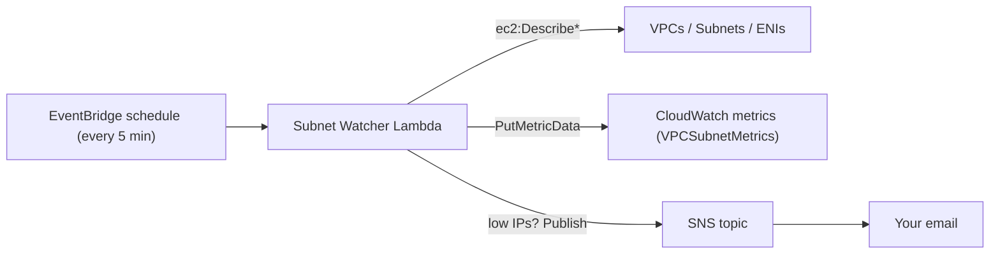

# 🔍 Subnet Watcher

> Get alerted **before** your AWS subnets run out of IP addresses.

## 🧠 What is this? (read me first)

Every AWS VPC subnet has a fixed pool of private IP addresses, decided by its CIDR
block (e.g. a `/24` = 256 addresses, minus [5 that AWS reserves](https://docs.aws.amazon.com/vpc/latest/userguide/configure-subnets.html)).
Every EC2 instance, container, Lambda ENI, load balancer node, and EKS pod consumes one.
When a subnet runs dry, **new resources simply fail to launch** — often during a scale-up
or deployment, exactly when you can least afford it.

The catch: **AWS gives small accounts no free, built-in gauge for this.** Subnet Watcher
fills that gap. It's a tiny scheduled Lambda that measures free IPs across your subnets,
publishes them as CloudWatch metrics, and emails you when a subnet gets too full.

## ✅ What you get

- 📊 **CloudWatch metrics** (namespace `VPCSubnetMetrics`) you can graph and alarm on.
- 📈 **A ready-made CloudWatch dashboard** that auto-discovers your subnets/VPCs — no manual setup.
- 📧 **Email alerts** (via SNS) when a subnet drops below your free-IP threshold.
- 🧹 **Detached-ENI visibility** so you can reclaim leaked network interfaces.
- 💸 **Cheap**: a 5-minute Lambda + a handful of custom metrics — no IPAM bill.

## 🏗 How it works



## 🚀 Quick start

1. Open the [`Makefile`](Makefile) and set the parameters (at minimum `AlertsRecipient`).
2. Deploy with the [AWS SAM CLI](https://docs.aws.amazon.com/serverless-application-model/latest/developerguide/install-sam-cli.html):

   ```bash
   make deploy
   ```

3. **Confirm the email subscription** AWS sends to `AlertsRecipient` (one-time click).
4. Open the dashboard: the stack prints a `DashboardURL` output, or go to
   CloudWatch → Dashboards → `<Project>-<Product>-<Environment>`.

To remove everything: `make delete`.

## 📺 Dashboard

`make deploy` creates a CloudWatch dashboard named `<Project>-<Product>-<Environment>` with
four panels, built from `SEARCH` expressions so it **automatically picks up every subnet, VPC,
and region** the Lambda reports — no IDs to maintain:

- Available IP Addresses (%) per subnet, with your warning threshold drawn as a red band.
- Available IP address count per subnet.
- Total usable IP addresses per subnet.
- Available (detached) ENIs per region.

The deploy prints the direct link as the `DashboardURL` stack output.

## 🆚 Why not just use AWS IPAM?

AWS *did* add a native subnet metric since this project started — `SubnetIPUsage`
(namespace `AWS/IPAM`, launched Aug 2023). For small accounts it's still not a great fit:

| | Subnet Watcher | AWS IPAM `SubnetIPUsage` |
| --- | --- | --- |
| Free IP **count** | ✅ Yes | ❌ Percentage only |
| Detached **ENI** tracking | ✅ Yes | ❌ No |
| Cost | A few custom metrics | Subnet utilization metrics need IPAM **Advanced Tier** (~$0.00027/active IP/hr ≈ **$3.65/IP/year**) |

So for a small workload, this Lambda stays the cheaper, more complete option.

## 🎛 Parameters

Set these in the [`Makefile`](Makefile):

|           Parameter          |              Description               | Required |    Default     |
| :--------------------------: | :------------------------------------: | :------: | :------------: |
|           `Product`          |          Name of the product           |  `yes`   | `subnet-watcher` |
|           `Project`          |          Name of your project          |  `yes`   |   `myproject`  |
|         `Environment`        |        Name of your environment        |  `yes`   |    `sandbox`   |
|          `AWSRegion`         |       Region to deploy the stack       |  `yes`   |   `eu-west-1`  |
|       `AlertsRecipient`      |    Email address that receives alerts  |  `yes`   |                |
| `PercentageRemainingWarning` | Alert when free IPs drop to this %      |  `yes`   |      `5`       |

**Scope of monitoring** (set as Lambda env vars in [`template.yaml`](template.yaml)):

- Leave both `REGION_ID` and `VPC_ID` empty → scans **every enabled region** (regions it
  can't access are skipped, not fatal).
- Set `REGION_ID` only → scans all VPCs in that one region.
- Set `REGION_ID` + `VPC_ID` → scans a single VPC.

## 📈 Metrics reference

All published under the `VPCSubnetMetrics` namespace:

| Metric | Dimensions | Meaning |
| --- | --- | --- |
| `AvailableIpAddressCount` | `VPCId`, `SubnetId` | Free IP addresses in the subnet |
| `TotalIpAddressCount` | `VPCId`, `SubnetId` | Usable IPs (CIDR size − 5 reserved) |
| `AvailableIpAddressPercent` | `VPCId`, `SubnetId` | Free IPs as a percentage |
| `AvailableNetworkInterface` | `Region` | Detached (`available`) ENIs in the region |

> 💡 CloudWatch custom metrics are billed per metric per month. Scanning many subnets across
> all regions multiplies the metric count — scope to a region/VPC to keep costs minimal.

### Sample


## 🎖️ Credits

Inspired by these projects:

- https://github.com/buzzsurfr/VpcSubnetIpMonitor
- https://github.com/mstockwell/Check-VPC-IP-Address-Space
